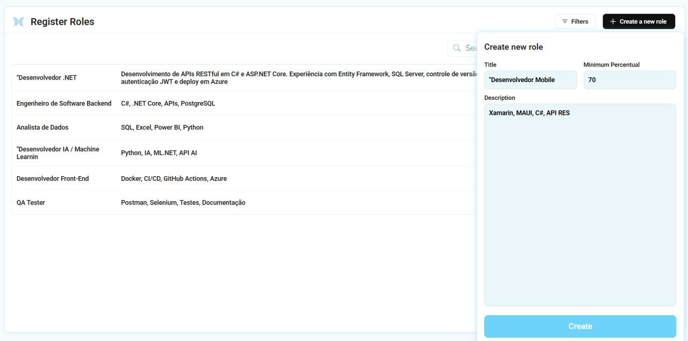
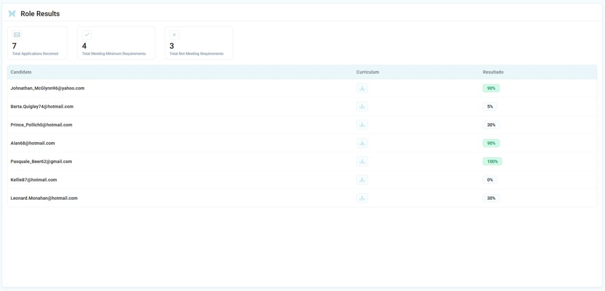
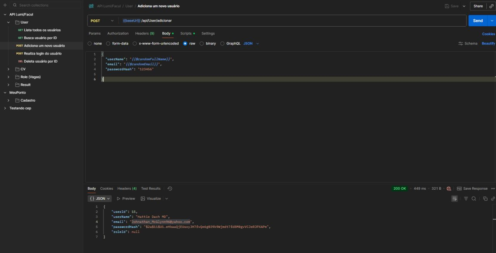
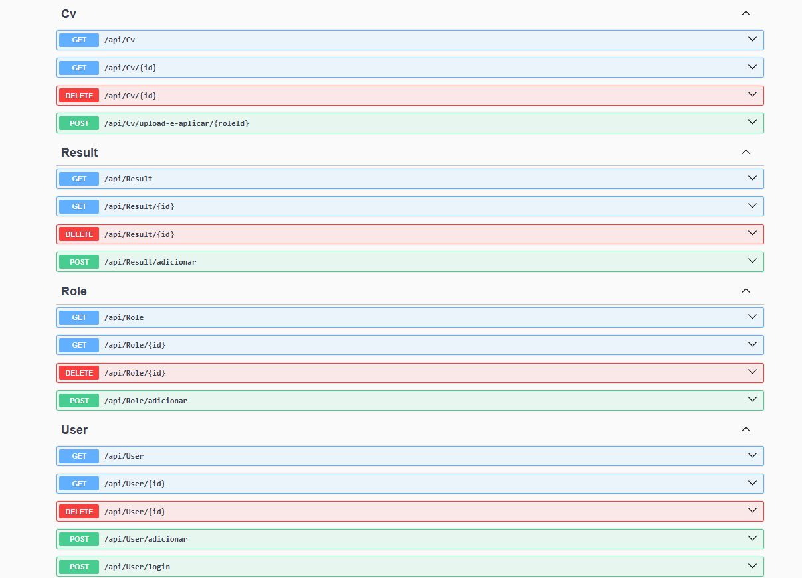

# 🦋 Lumi — RH Acadêmico com Inteligência Artificial

Sistema de RH acadêmico onde candidatos se inscrevem em vagas de emprego e têm seus currículos avaliados **automaticamente por IA**, de acordo com o percentual de compatibilidade entre as skills do candidato e as exigidas pelo contratante.

Foi meu primeiro contato direto integrando uma Inteligência Artificial em um sistema real — manipulando e interpretando, dentro da própria API, os dados retornados pela IA.

## Funcionalidades

- ✅ Cadastro e login de usuários
- 📄 Envio e tratamento de currículos em diferentes formatos (PDF, Word, DOC)
- 🤖 Avaliação de currículos pela IA, de acordo com a vaga e o percentual mínimo de aprovação
- 📊 Armazenamento e análise dos resultados de forma individual e organizada
- 🧪 Testes completos via Postman, cobrindo o funcionamento e a integração entre todos os endpoints

## Tecnologias

- **C#** / **ASP.NET Core**
- **Entity Framework Core**
- Integração com API de IA para análise de currículos
- **Swagger** para documentação interativa dos endpoints
- **Postman** para testes de integração

## Endpoints da API

| Método | Rota | Descrição |
|---|---|---|
| `POST` | `/api/User/adicionar` | Cadastra um novo usuário |
| `POST` | `/api/User/login` | Autentica um usuário |
| `GET` | `/api/User` | Lista todos os usuários |
| `GET` | `/api/User/{id}` | Busca usuário por ID |
| `DELETE` | `/api/User/{id}` | Remove um usuário |
| `POST` | `/api/Cv/upload-e-aplicar/{roleId}` | Envia currículo e aplica para uma vaga |
| `GET` | `/api/Cv` | Lista todos os currículos |
| `GET` | `/api/Cv/{id}` | Busca currículo por ID |
| `DELETE` | `/api/Cv/{id}` | Remove um currículo |
| `POST` | `/api/Role/adicionar` | Cadastra uma nova vaga |
| `GET` | `/api/Role` | Lista todas as vagas |
| `GET` | `/api/Role/{id}` | Busca vaga por ID |
| `DELETE` | `/api/Role/{id}` | Remove uma vaga |
| `POST` | `/api/Result/adicionar` | Registra o resultado da avaliação de um candidato |
| `GET` | `/api/Result` | Lista todos os resultados |
| `GET` | `/api/Result/{id}` | Busca resultado por ID |
| `DELETE` | `/api/Result/{id}` | Remove um resultado |

## Capturas de tela

**Tela de login**


**Cadastro de vagas (Register Roles)**


**Resultados dos candidatos, com percentual de compatibilidade calculado pela IA**


**Coleção de testes no Postman**


**Documentação dos endpoints (Swagger)**


## Estrutura do projeto

> ⚠️ O código-fonte está aninhado em subpastas. Para abrir a solução, navegue até:
> ```
> ProjetoFaculdade6Semestre/ProjetoFaculdade6Semestre/
> ```
> É lá que fica o `ProjetoFaculdade6Semestre.sln`, junto com as pastas do projeto:

```
ProjetoFaculdade6Semestre/
└── ProjetoFaculdade6Semestre/
    ├── Controllers/    # endpoints da API (User, Cv, Role, Result)
    ├── DbContext/      # contexto do Entity Framework
    ├── Helpers/        # funções auxiliares
    ├── Interface/       # contratos/interfaces dos serviços
    ├── Migrations/      # migrations do banco de dados
    ├── Model/           # entidades do domínio
    ├── Properties/       # configurações do projeto
    ├── Service/          # regras de negócio (incluindo integração com a IA)
    ├── Utils/            # utilitários gerais
    └── ProjetoFaculdade6Semestre.sln
```

## Rodando localmente

```bash
git clone https://github.com/MarcusGomesp/ProjetoFaculLumi.git
cd ProjetoFaculLumi/ProjetoFaculdade6Semestre/ProjetoFaculdade6Semestre
dotnet restore
dotnet run
```

A documentação interativa dos endpoints fica disponível via Swagger assim que o projeto sobe.

## Aprendizados

Esse projeto marcou meu primeiro contato direto integrando uma Inteligência Artificial em um sistema real. Aprendi bastante sobre integração de APIs externas, análise e tratamento de dados retornados por IA, testes de API e arquitetura de sistemas inteligentes — mais um passo na jornada como Desenvolvedor Back-End Jr em C# / .NET.

## Contato

- LinkedIn: [Marcus Vinicius Gomes](https://www.linkedin.com/in/marcus-vinicius-gomes-226552249/)
- GitHub: [@MarcusGomesp](https://github.com/MarcusGomesp)
